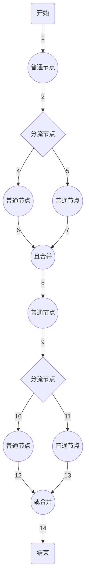

# kmFlow

#### 介绍
KmFlow是一流程引擎类库。KmFlow最大的特点是：支持并行执行和自动执行。

#### 名词定义
1. 流程图——是一个模板，静态的组合
2. 节点——流程图中的点
3. 线——流程图中点之间互相连接的线
4. 流程——是指流程图运行时的一个实例。流程图可以理解成“类”，流程理解成“对象”

#### 类库设计说明

#### 支持的流程图

更多流程图，请看测试用例

