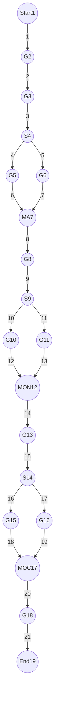

```mermaid
graph TD
Start1((Start1)) --1-->G2((G2)) 
G2((G2)) --2-->G3((G3)) 
G3((G3)) --3-->S4((S4)) 
S4((S4)) --4-->G5((G5)) 
S4((S4)) --5-->G6((G6)) 
G5((G5)) --6-->MA7((MA7)) 
G6((G6)) --7-->MA7((MA7)) 
MA7((MA7)) --8-->G8((G8)) 
G8((G8)) --9-->S9((S9)) 
S9((S9)) --10-->G10((G10)) 
S9((S9)) --11-->G11((G11)) 
G10((G10)) --12-->MON12((MON12)) 
G11((G11)) --13-->MON12((MON12)) 
MON12((MON12)) --14-->G13((G13)) 
G13((G13)) --15-->S14((S14)) 
S14((S14)) --16-->G15((G15)) 
S14((S14)) --17-->G16((G16)) 
G15((G15)) --18-->MOC17((MOC17)) 
G16((G16)) --19-->MOC17((MOC17)) 
MOC17((MOC17)) --20-->G18((G18)) 
G18((G18)) --21-->End19((End19)) 
```