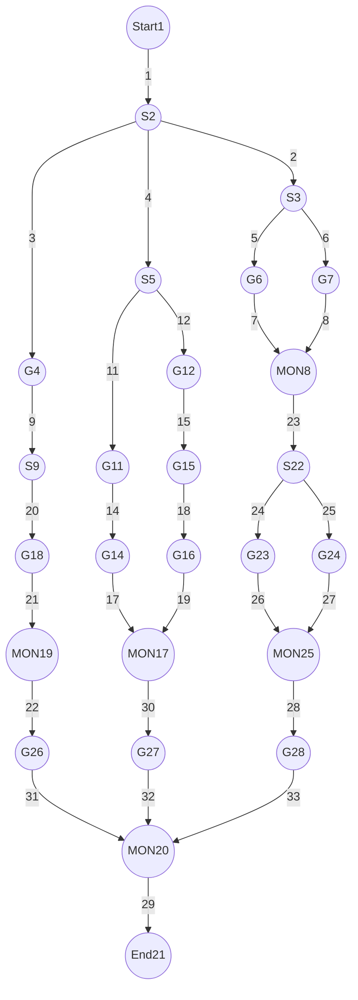

```mermaid
            graph TD
            Start1((Start1)) --1-->S2((S2)) 
S2((S2)) --2-->S3((S3)) 
S2((S2)) --3-->G4((G4)) 
S2((S2)) --4-->S5((S5)) 
S3((S3)) --5-->G6((G6)) 
S3((S3)) --6-->G7((G7)) 
G6((G6)) --7-->MON8((MON8)) 
G7((G7)) --8-->MON8((MON8)) 
G4((G4)) --9-->S9((S9)) 
S5((S5)) --11-->G11((G11)) 
S5((S5)) --12-->G12((G12)) 
G11((G11)) --14-->G14((G14)) 
G12((G12)) --15-->G15((G15)) 
G14((G14)) --17-->MON17((MON17)) 
G15((G15)) --18-->G16((G16)) 
G16((G16)) --19-->MON17((MON17)) 
S9((S9)) --20-->G18((G18)) 
G18((G18)) --21-->MON19((MON19)) 
MON19((MON19)) --22-->G26((G26)) 
MON8((MON8)) --23-->S22((S22)) 
S22((S22)) --24-->G23((G23)) 
S22((S22)) --25-->G24((G24)) 
G23((G23)) --26-->MON25((MON25)) 
G24((G24)) --27-->MON25((MON25)) 
MON25((MON25)) --28-->G28((G28)) 
MON20((MON20)) --29-->End21((End21)) 
MON17((MON17)) --30-->G27((G27)) 
G26((G26)) --31-->MON20((MON20)) 
G27((G27)) --32-->MON20((MON20)) 
G28((G28)) --33-->MON20((MON20)) 
```