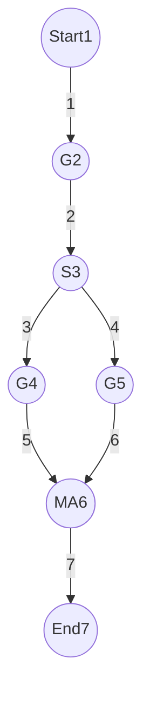
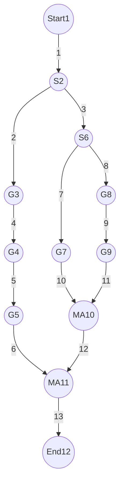
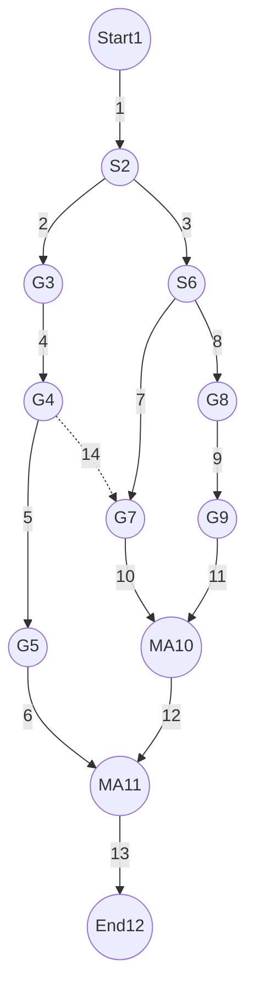

# simple_test

```mermaid
graph TD
Start1((Start1)) --1-->G2((G2)) 
G2((G2)) --2-->S3((S3)) 
S3((S3)) --3-->G4((G4)) 
S3((S3)) --4-->G5((G5)) 
G4((G4)) --5-->MA6((MA6)) 
G5((G5)) --6-->MA6((MA6)) 
MA6((MA6)) --7-->End7((End7)) 
```
# multilayer_test

```mermaid
graph TD
Start1((Start1)) --1-->S2((S2)) 
S2((S2)) --2-->G3((G3)) 
S2((S2)) --3-->S6((S6)) 
G3((G3)) --4-->G4((G4)) 
G4((G4)) --5-->G5((G5)) 
G5((G5)) --6-->MA11((MA11)) 
S6((S6)) --7-->G7((G7)) 
S6((S6)) --8-->G8((G8)) 
G8((G8)) --9-->G9((G9)) 
G7((G7)) --10-->MA10((MA10)) 
G9((G9)) --11-->MA10((MA10)) 
MA10((MA10)) --12-->MA11((MA11)) 
MA11((MA11)) --13-->End12((End12)) 
```
# multilayer_error_test

```mermaid
graph TD
Start1((Start1)) --1-->S2((S2)) 
S2((S2)) --2-->G3((G3)) 
S2((S2)) --3-->S6((S6)) 
G3((G3)) --4-->G4((G4)) 
G4((G4)) --5-->G5((G5)) 
G5((G5)) --6-->MA11((MA11)) 
S6((S6)) --7-->G7((G7)) 
S6((S6)) --8-->G8((G8)) 
G8((G8)) --9-->G9((G9)) 
G7((G7)) --10-->MA10((MA10)) 
G9((G9)) --11-->MA10((MA10)) 
MA10((MA10)) --12-->MA11((MA11)) 
MA11((MA11)) --13-->End12((End12)) 
G4((G4)) -.14.->G7((G7)) 
```