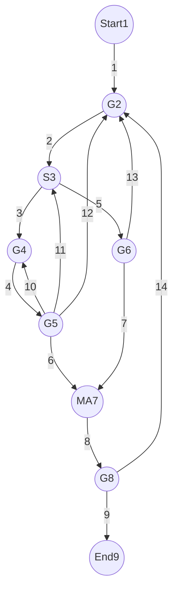

```mermaid
graph TD
Start1((Start1)) --1-->G2((G2)) 
G2((G2)) --2-->S3((S3)) 
S3((S3)) --3-->G4((G4)) 
G4((G4)) --4-->G5((G5)) 
S3((S3)) --5-->G6((G6)) 
G5((G5)) --6-->MA7((MA7)) 
G6((G6)) --7-->MA7((MA7)) 
MA7((MA7)) --8-->G8((G8)) 
G8((G8)) --9-->End9((End9)) 
G5((G5)) --10-->G4((G4)) 
G5((G5)) --11-->S3((S3)) 
G5((G5)) --12-->G2((G2)) 
G6((G6)) --13-->G2((G2)) 
G8((G8)) --14-->G2((G2)) 
```