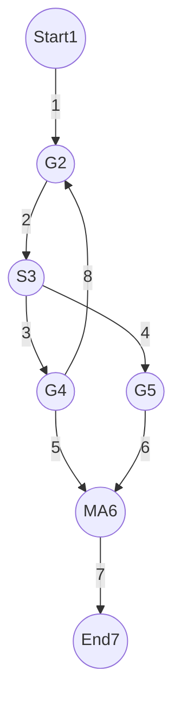

# simple_test

```mermaid
graph TD
Start1((Start1)) --1-->G2((G2)) 
G2((G2)) --2-->S3((S3)) 
S3((S3)) --3-->G4((G4)) 
G4((G4)) --8-->G2((G2)) 
S3((S3)) --4-->G5((G5)) 
G4((G4)) --5-->MA6((MA6)) 
G5((G5)) --6-->MA6((MA6)) 
MA6((MA6)) --7-->End7((End7)) 
```