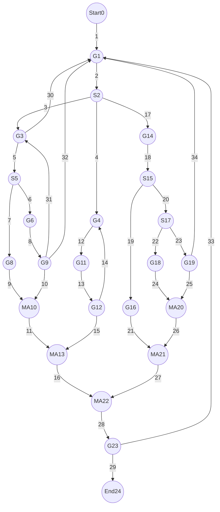

```mermaid
graph TD
Start0((Start0)) --1-->G1((G1)) 
G1((G1)) --2-->S2((S2)) 
S2((S2)) --3-->G3((G3)) 
S2((S2)) --4-->G4((G4)) 
G3((G3)) --5-->S5((S5)) 
S5((S5)) --6-->G6((G6)) 
S5((S5)) --7-->G8((G8)) 
G6((G6)) --8-->G9((G9)) 
G8((G8)) --9-->MA10((MA10)) 
G9((G9)) --10-->MA10((MA10)) 
MA10((MA10)) --11-->MA13((MA13)) 
G4((G4)) --12-->G11((G11)) 
G11((G11)) --13-->G12((G12)) 
G12((G12)) --14-->G4((G4)) 
G12((G12)) --15-->MA13((MA13)) 
MA13((MA13)) --16-->MA22((MA22)) 
S2((S2)) --17-->G14((G14)) 
G14((G14)) --18-->S15((S15)) 
S15((S15)) --19-->G16((G16)) 
S15((S15)) --20-->S17((S17)) 
G16((G16)) --21-->MA21((MA21)) 
S17((S17)) --22-->G18((G18)) 
S17((S17)) --23-->G19((G19)) 
G18((G18)) --24-->MA20((MA20)) 
G19((G19)) --25-->MA20((MA20)) 
MA20((MA20)) --26-->MA21((MA21)) 
MA21((MA21)) --27-->MA22((MA22)) 
MA22((MA22)) --28-->G23((G23)) 
G23((G23)) --29-->End24((End24)) 
G3((G3)) --30-->G1((G1)) 
G9((G9)) --31-->G3((G3)) 
G9((G9)) --32-->G1((G1)) 
G23((G23)) --33-->G1((G1)) 
G19((G19)) --34-->G1((G1)) 
```